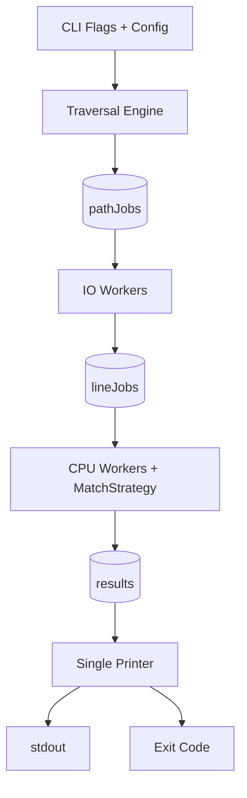
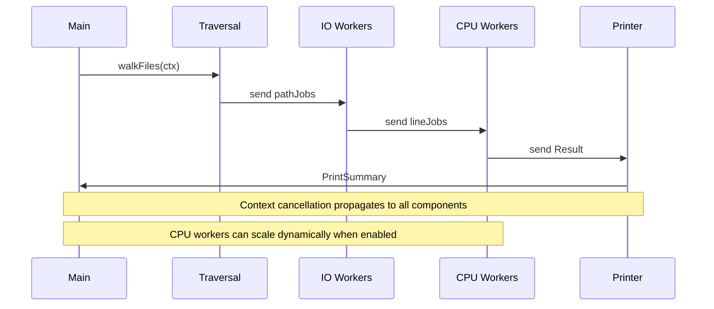

# gosearch Product Specification

This document consolidates all design, architecture, and technical documentation for the gosearch project.

---

## Table of Contents

1. [README](#readme)
2. [Design Document](#design-document)
3. [Changelog](#changelog)
4. [Architecture](#architecture)
5. [Concurrency Model](#concurrency-model)
6. [Design Tradeoffs](#design-tradeoffs)
7. [Performance Report](#performance-report)
8. [Why Not X?](#why-not-x)

---

## README

```text
   ____  ____  _________  _____  __________  ________
  / __ \/ __ \/ ___/ __ \/ ___/ / ____/ __ \/ ____/ /
 / /_/ / / / /\__ \/ /_/ /\__ \ / __/ / /_/ / /   / /
/ _, _/ /_/ /___/ / ____/___/ // /___/ _, _/ /___/ /___
/_/ |_|\____//____/_/    /____//_____/_/ |_|\____/_____/
```

`gosearch` is a high-throughput, concurrency-first CLI search engine for real repositories.

If standard grep-style workflows feel too bare and heavy codebases need more control, this is the upgrade path: recursive traversal, ignore-rule awareness, structured output, deterministic exit semantics, and deep observability when you need to tune performance.

### What You Built

- Recursive search with streaming output.
- Concurrency pipeline split into traversal, IO, CPU matching, and single-owner printing.
- Substring and regex strategies with startup regex precompilation.
- Ignore-aware traversal via `.gitignore` and `.gosearchignore` (with inheritance and negation).
- Symlink controls with loop prevention.
- Production-grade CLI surface: filters, output modes, metrics, tracing, profiling, config defaults.
- Full engineering package: tests, race checks, fuzzing, benchmarks, completions, man page, release scripts.

### Fast Start

```bash
go build -o gosearch .
./gosearch "needle" ./testdata/small
```

Command contract:

```text
gosearch [flags] <pattern> <path>
```

### Practical Commands

```bash
# case-insensitive search
./gosearch -i "todo" .

# whole-word exact token matching
./gosearch -w "Config" .

# regex mode
./gosearch -regex "func\\s+main" .

# JSON output for tooling/pipelines
./gosearch -format json "error" .

# count-only mode (fast reporting)
./gosearch -count "needle" ./testdata

# quiet mode for scripting via exit code only
./gosearch -quiet "needle" ./testdata

# restrict by extension and max file size
./gosearch -extensions .go,.md -max-size 2MB "worker" .

# follow symlinks up to bounded depth
./gosearch -follow-symlinks -max-depth 6 "TODO" .
```

### Full Flag Reference

#### Search behavior

- `-i` case-insensitive search
- `-n` show line numbers (default `true`, set `-n=false` to disable)
- `-w` whole-word matching
- `-regex` treat pattern as regex

#### Input scope and filtering

- `-extensions .go,.txt` include only listed extensions
- `-exclude-dir vendor,node_modules` skip named directories
- `-max-size 10MB` skip files larger than threshold (bytes/KB/MB/GB)
- `-max-depth N` cap traversal depth (`-1` = unlimited)
- `-follow-symlinks` include symlinked files/dirs with loop prevention

#### Output modes

- `-format plain|json` choose output format
- `-count` print total match count only
- `-quiet` suppress output; rely on exit code
- `-color` enable ANSI highlight in plain mode
- `-abs` print absolute paths

#### Worker and throughput controls

- `-workers N` base worker count
- `-io-workers N` IO workers (`0` = auto)
- `-cpu-workers N` CPU workers (`0` = auto)
- `-dynamic-workers` enable dynamic CPU scaling
- `-max-workers N` cap dynamic CPU workers (`0` = auto)
- `-backpressure N` channel buffer size (`0` = auto)

#### Diagnostics and profiling

- `-metrics` print worker lifecycle and throughput metrics
- `-debug` debug logging
- `-trace` verbose trace logging
- `-monitor-goroutines` periodic goroutine count logging
- `-monitor-interval-ms N` monitor interval (minimum `10`, default `250`)
- `-cpuprofile file.out` write CPU profile
- `-memprofile file.out` write heap profile on exit

#### Config and CLI metadata

- `-config path/to/.gosearchrc` load JSON defaults
- `-completion bash|zsh|fish` print completion script
- `-version` print build version

### Output Contract

Plain output (`-format plain`, default):

```text
path/to/file:line_number: line_text
```

JSON output (`-format json`):

```json
{"path":"...","line":12,"text":"..."}
```

Exit codes:

- `0` one or more matches found
- `1` no matches found
- `2` invalid usage or fatal setup/runtime error

### Ignore and Symlink Semantics

- Traversal parses `.gitignore` and `.gosearchignore`.
- Ignore rules are inherited by child directories.
- Negation patterns (`!pattern`) can re-include paths at deeper levels.
- Default ignored directories include `.git`, `vendor`, and `node_modules`.
- Ignore pruning happens before work enqueue, so ignored paths never hit workers.
- Symlinks are skipped unless `-follow-symlinks` is enabled.
- Directory symlink loops are blocked using resolved-path tracking.

### Config File

Default path is `.gosearchrc`.

Example:

```json
{
  "ignore_case": true,
  "workers": 8,
  "format": "json",
  "dynamic_workers": true
}
```

Precedence rule: CLI flags always override config values.

### Architecture Snapshot

```text
walk filesystem
  -> path jobs
    -> IO workers (read + binary detection)
      -> line jobs
        -> CPU workers (match strategy)
          -> result channel
            -> single printer goroutine
```

Design priorities:

- no output interleaving
- bounded concurrency
- deterministic shutdown
- cancellation propagation via context

### Testing and Validation

Windows one-command validation:

```powershell
./scripts/test.ps1
```

Optional fuzz mode:

```powershell
./scripts/test.ps1 -IncludeFuzz
```

Cross-platform manual commands:

```bash
go test -count=1 ./...
go test -count=1 -race ./...
go test -bench=. -benchmem ./...
go test -fuzz=Fuzz -run=^$ ./...
```

### Release Workflow

```bash
make cross VERSION=vX.Y.Z
make release VERSION=vX.Y.Z
```

Version injection:

```bash
go build -ldflags "-X main.version=vX.Y.Z" -o gosearch .
```

Release helpers:

- `scripts/release.sh`
- `scripts/release.ps1`

### Completions and Man Page

- Man page: `man/gosearch.1`
- Completion assets:
  - `completions/bash/gosearch.bash`
  - `completions/zsh/_gosearch`
  - `completions/fish/gosearch.fish`

Generate from CLI:

```bash
gosearch -completion bash
gosearch -completion zsh
gosearch -completion fish
```

### Known Limitations

- Output order is intentionally non-deterministic under concurrency.
- SIGINT behavior in tests differs on Windows compared to Unix-like environments.

---

## Design Document

### What this project is

`gosearch` is a concurrent command-line search tool for recursively scanning files and reporting matching lines. It is designed to be fast, predictable, and practical for real repositories.

### Product goals

- Search recursively with bounded concurrency.
- Stream output instead of buffering all results.
- Handle cancellation cleanly.
- Provide practical CLI ergonomics for daily use.
- Keep behavior testable and release-ready.

### Runtime architecture

Pipeline:

1. Filesystem traversal with ignore-rule pruning
2. Path jobs sent to IO workers
3. IO workers open/read files and emit line jobs
4. CPU workers evaluate match strategy and emit results
5. Single printer goroutine owns output

Key properties:

- Context cancellation propagates across all stages
- Single output owner prevents interleaved writes
- Worker counts and channel backpressure are configurable
- Optional dynamic CPU worker scaling for bursty workloads

### Matching model

- Substring strategy (default)
- Regex strategy (`-regex`), compiled once at startup
- Optional whole-word and case-insensitive matching

### Filesystem semantics

- Supports `.gitignore` and `.gosearchignore`
- Ignore rules inherit by directory depth
- Negation rules (`!pattern`) are supported
- Default ignored directories: `.git`, `vendor`, `node_modules`
- Symlinks are skipped by default and can be enabled with loop prevention

### CLI contract

Command format:

```text
gosearch [flags] <pattern> <path>
```

Exit codes:

- `0`: one or more matches found
- `1`: no matches
- `2`: invalid usage or fatal runtime/setup error

Config:

- Optional JSON defaults from `.gosearchrc`
- CLI flags override config values

### Observability and performance tooling

- Metrics mode includes worker lifecycle and phase timings
- Debug/trace logging modes are available
- Optional CPU and heap profile outputs
- Benchmark and fuzz suites are included

### Quality strategy

- Unit and integration tests for search behavior and CLI flows
- Ignore/symlink edge-case tests
- Race-detector test runs
- Property-based and fuzz testing for robustness

### Release tooling

- Version injection via `-ldflags`
- Man page and shell completions (bash/zsh/fish)
- Cross-build and checksum workflows via Makefile and scripts

---

## Changelog

All notable improvements to `gosearch` are documented here.

### v1.0.0 (Project maturity release)

#### Added

- Full CLI surface for search behavior, output modes, and worker controls.
- JSON output, quiet/count modes, and color highlighting support.
- Regex matching mode with startup precompilation.
- Config-file defaults via `.gosearchrc` (JSON).
- Shell completion support (bash, zsh, fish) and built-in completion generation.
- `-version` support with ldflags version injection.
- Man page and release automation scripts.
- Benchmarks, fuzz tests, and property-based correctness checks.
- Runtime observability flags: debug, trace, metrics, goroutine monitoring.

#### Improved

- Search engine architecture split into traversal, IO, CPU, and output stages.
- Ignore-rule handling with inherited `.gitignore` and `.gosearchignore` semantics.
- Symlink policy with loop prevention.
- Dynamic CPU worker scaling and configurable backpressure.

#### Reliability

- Expanded tests for edge cases and integration behavior.
- Stable exit code contract:
  - `0` match found
  - `1` no matches
  - `2` invalid usage/fatal runtime error
- Race-detector clean test runs.

#### Notes

This release reflects progression from an MVP search utility to a production-style CLI project suitable for portfolio use.

---

## Architecture



### Notes

- Traversal handles ignore rules, depth limits, symlink policy, and enqueue pruning.
- IO workers handle file access, binary checks, and line extraction.
- CPU workers handle substring/regex matching through a strategy interface.
- Printer is the only output writer and controls final result counting.

---

## Concurrency Model



### Guarantees

- Bounded channels provide backpressure.
- Exactly one printer goroutine writes output.
- Worker lifecycle metrics are tracked using atomics.

---

## Design Tradeoffs

### 1) Split IO and CPU Workers

- Chosen for clearer bottleneck isolation and scaling control.
- Tradeoff: more channels and lifecycle complexity.

### 2) Ignore Rules During Traversal

- Chosen to prune early and avoid wasted worker work.
- Tradeoff: more traversal logic and rule-state propagation.

### 3) Strategy Interface for Matching

- Chosen to isolate substring/regex logic from worker pipeline.
- Tradeoff: one more abstraction layer.

### 4) Explicit Backpressure Buffers

- Chosen for predictable memory and flow control.
- Tradeoff: queue tuning required for best performance.

### 5) Runtime Profiling Flags

- Chosen to simplify local diagnostics without external wrappers.
- Tradeoff: optional code paths increase config surface.

---

## Performance Report

### Environment

- OS: Windows
- CPU: Intel Core Ultra 5 125H
- Go benchmark mode: `go test -run ^$ -bench . -benchmem -count=3 ./...`

### Benchmark Results

#### Scanner vs Reader (`BenchmarkScannerVsReader`)

- Scanner latency range: ~586,708 to ~1,090,551 ns/op
- Reader latency range: ~941,451 to ~1,012,973 ns/op
- Scanner allocations: ~469,976 B/op, 9,163 allocs/op
- Reader allocations: ~224,352 B/op, 9,147 allocs/op

Conclusion:

- Reader path materially reduced memory allocation in this workload.
- Latency differences were mixed across runs, but memory profile clearly favored reader mode.

#### Worker Scaling (`BenchmarkWorkerScaling`)

- workers=1: ~20.4ms to ~25.9ms per run
- workers=2: ~27.7ms to ~34.5ms per run
- workers=4: ~19.9ms to ~21.8ms per run
- workers=8: ~22.6ms to ~28.8ms per run

Conclusion:

- Best observed range was at 4 workers for this benchmark fixture.
- Over-scaling to 8 workers did not improve consistently.

#### Large Directory Stress (`BenchmarkLargeDirectoryStress`)

- Latency range: ~20.2ms to ~23.7ms per run
- Allocation range: ~1,513,286 to ~1,524,581 B/op
- Allocations: ~37,950 allocs/op

Conclusion:

- Stress benchmark remained stable across three passes.
- No pathological blow-up observed for the synthetic large fixture.

### Runtime Profiling Capture

Command used:

```powershell
.\gosearch.exe -cpuprofile cpu-stage4.out -memprofile mem-stage4.out needle .\testdata\small
```

Artifacts produced in project root:

- `cpu-stage4.out`
- `mem-stage4.out`

### Key Takeaways

- Worker count should be tuned per workload instead of maximized blindly.
- Allocation pressure is an important optimization axis alongside raw latency.
- Runtime profile artifacts are now part of reproducible diagnostics for regressions.

---

## Why Not X?

### Why not goroutine-per-file?

Unbounded goroutine creation harms predictability under very large trees.

### Why not regex-only mode?

Substring matching is faster and sufficient for many workflows.

### Why not global ignore cache?

Per-directory inheritance is easier to reason about and keeps rule precedence local.

### Why not parallel printers?

Single printer preserves output integrity without interleaving.

### Why not full daemon/service mode?

This project is intentionally CLI-first with bounded execution and simple operational model.
