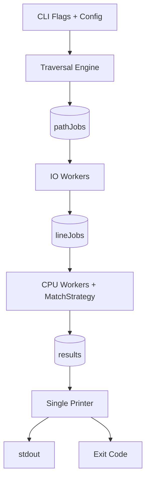

# Architecture Diagram

## Notes

- Traversal handles ignore rules, depth limits, symlink policy, and enqueue pruning.
- IO workers handle file access, binary checks, and line extraction.
- CPU workers handle substring/regex matching through a strategy interface.
- Printer is the only output writer and controls final result counting.
