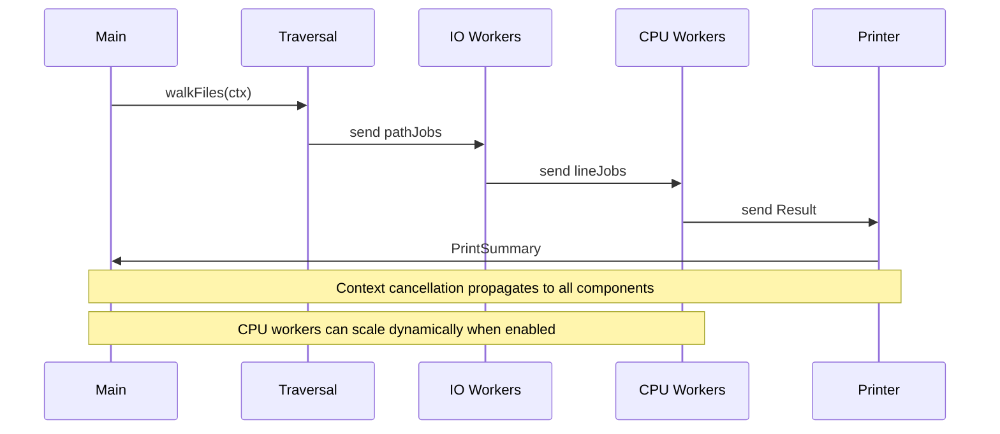

# Concurrency Diagram

```mermaid
sequenceDiagram
    participant Main
    participant Walk as Traversal
    participant IO as IO Workers
    participant CPU as CPU Workers
    participant Print as Printer

    Main->>Walk: walkFiles(ctx)
    Walk->>IO: send pathJobs
    IO->>CPU: send lineJobs
    CPU->>Print: send Result
    Print->>Main: PrintSummary

    Note over Main,Print: Context cancellation propagates to all components
    Note over Main,CPU: CPU workers can scale dynamically when enabled
```

## Guarantees

- Bounded channels provide backpressure.
- Exactly one printer goroutine writes output.
- Worker lifecycle metrics are tracked using atomics.
